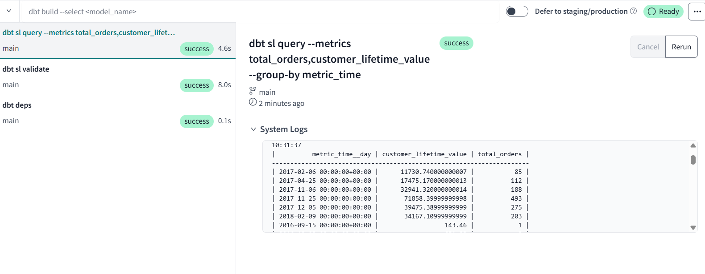
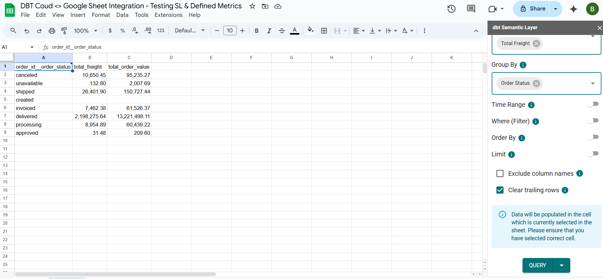

# Olist Brazilian E-Commerce Data Modeling Project

## Overview

This project involves the use of DBT to build a structured data model from the Brazilian e-commerce dataset [Olist](https://www.kaggle.com/datasets/olistbr/brazilian-ecommerce) provided by Kaggle. The objective of the project was to clean, transform, and define key metrics from the raw data to enable meaningful business insights all via DBT. 

I’ve built a full DBT pipeline, including staging, intermediate, marts, and semantic layers. In addition, I have documented each field and added tests. Below, I’ll explain how I approached the task, the relationships between tables, the metrics I defined, and the structure of my DBT models.

## Step 1: Understanding the Data

Before diving into the modeling, I studied the dataset to understand what each table represents, the relationships between tables and how they interact, the values within each field to understand how I can treat them during transformation. Basically a whole exploratory analysis was done. This was done by using a mix of Microsoft Excel and some easy python scripts. 
Below is an overview of the key tables and their relationships:

### 1. **Customers Table (`customers`)**
   - **Represents**: Information about the customers who made the orders.
   - **Key Columns**:
     - `customer_id`: Unique identifier for the customer.
     - `customer_unique_id`: A unique code that identifies the customer across orders.
     - `customer_city`: The city where the customer is located.

### 2. **Orders Table (`orders`)**
   - **Represents**: Contains data about customer orders in the e-commerce system.
   - **Key Columns**:
     - `order_id`: Unique identifier for each order.
     - `customer_unique_id`: Unique identifier for each customer across the whole system.
     - `order_status`: The status of the order (example: delivered, canceled, etc).
     - `order_purchase_timestamp`: Timestamp when the order was purchased.
     - `order_delivered_customer_date`: Timestamp when the order was delivered to the customer.

### 3. **Order Items Table (`order_items`)**
   - **Represents**: This table captures details of the items within each order.
   - **Key Columns**:
     - `order_id`: Foreign key linking to the `orders` table.
     - `order_item_id`: Identifier for each item within an order because orders can have multiple items.
     - `product_id`: Unique identifier for each product.
     - `seller_id`: Identifier for the seller of the product.
     - `price`: The Price of the product item.
     - `freight_value`: The shipping cost associated with the product item.

### 4. **Products Table (`products`)**
   - **Represents**: Data about the products available in the marketplace.
   - **Key Columns**:
     - `product_id`: Unique identifier for each product.
     - `product_category_name`: Category of the product in Portuguese.
     - `product_photos_qty`: Number of photos for the product.

### 5. **Sellers Table (`sellers`)**
   - **Represents**: Information about the sellers.
   - **Key Columns**:
     - `seller_id`: Unique identifier of the seller.
     - `seller_city`: City name of the seller.

### 6. **Payments Table (`payments`)**
   - **Represents**: Data related to the payment information for orders.
   - **Key Columns**:
     - `order_id`: Foreign key linking to the `orders` table.
     - `payment_type`: Payment method (example: credit_card, voucher, etc).
     - `payment_value`: Amount paid for the order.

The relationships between these tables are important for defining key metrics and building a structured model. This screenshot was directly taken from Kaggle.

## Step 2: Business Metrics Defined

Several KPIs can be important for understanding business performance for this dataset. These metrics help understand customer behavior, sales trends, and overall business efficiency. Here are the primary metrics I focused on:

- **Total Revenue per Month:** Measures the monthly sales and the rate at which revenue is increasing or decreasing over time.
- **Total Products Sold per Month:** Indicates the volume of products sold monthly. We can understand sales trends and seasonality.
- **Customer Lifetime Value (CLV):** The projected revenue from a customer over the entire duration of their relationship with Olist.
- **Customer Retention Rate:** Represents the percentage of repeat customers over a specific period.
- **Customer Churn Rate:** To understand the percentage of customers who stop purchasing over a given period.
- **Average Order Value (AOV):** Calculates the average revenue per order.
- **Delivery Status (Late vs. On-Time Deliveries):** Evaluates the efficiency of the delivery process by comparing late deliveries to those on time.

The metrics I’ve chosen for this project are defined across several key dimensions, such as time, order status, payment type, product category, customer, and city. In addition, I have defined metrics at the product and sellers level that fall into a separate category but I believe these are important segmentations.  

**Note that:** I made the decision to focus on specific metrics early on in order to streamline the project and avoid it becoming overly complex. By selecting a few key metrics, I can better understand the types of models I need to build and make sure they are optimized for performance and structured to answer the core business questions.
Had I chosen additional metrics, I would have needed to build extra models or add more fields to existing ones. However, my goal was to prioritize the development of a well structured semantic layer, rather than trying to answer every possible business question for this specific project.

## Step 3: Project Setup / Tech Stack

I started this project from scratch by following these key steps:
1. **Setting up Google Cloud Project and BigQuery:**
   * Created a Google Cloud Project and enabled BigQuery as the data warehouse for this project. 
   * Imported the source CSV files into BigQuery and gave the necessary permissions were set up to allow querying and processing of models. 
   * Verified that the data was correctly loaded (via some simple queries within bigquery vs the original csv files) and accessible for transformation in DBT.
2. **Configuring DBT Core within PyCharm:**
   * Installed and configured DBT Core in PyCharm. This was done for local development and testing. 
   * Set up a virtual environment and made sure all dependencies (such as dbt databases, packages and so on) were correctly installed.
   * Configured DBT profiles.yml to connect BigQuery with DBT Core. Integrated GitHub for version control.
3. **Building the Data Pipeline with DBT Core:**
   * Designed and developed DBT models to clean, transform, and structure raw data into meaningful business tables. 
   * Implemented staging, intermediate, and marts models, applying best practices for reusable, and scalable transformations. 
   * Conducted thorough testing on each model using DBT's built-in schema and data tests (example, uniqueness, not null) and also singular tests vs the BigQuery DB via SQL to ensure data integrity. 
   * Created documentation for each model, providing detailed descriptions of transformations and relationships between tables.
4. **Leveraging DBT Cloud for Semantic & Metric Layers:**
   * Migrated the final Marts models to Semantic Layers and utilized DBT Cloud IDE to utilize its Semantic Layer capability for improve visibility, automate model execution via scheduled runs, and ensuring the business metrics are correctly defined. 
   * Defined key business metrics (such as revenue, customer retention, and churn rate) to ensure consistency across reporting tools. 
5. **Integrating DBT Cloud’s Semantic Layer with Google Sheets:**
   * Connected DBT Cloud’s Semantic Layer to Google Sheets, allowing for real time access to structured business metrics. 

## Step 4: Data Layers

I organized the DBT models into three main layers, each serving a different purpose in the pipeline:

### 1. **Staging Layer** (olist_dbt/models/staging)
   - The **staging models** serve as the initial transformation step, cleaning and preparing the raw data for further processing.
   - These models handle data types, null values, and basic cleaning operations (example, renaming columns, formatting dates).
   - Staging models include:
     - `stg_customers`
     - `stg_orders`
     - `stg_order_items`
     - ...

### 2. **Intermediate Layer** (olist_dbt/models/intermediate)
   - Intermediate models aggregate, join, and enrich the data from the staging layer, preparing it for more advanced analysis.
   - These models ensure that data is aligned across different tables and ready for business logic.
   - Intermediate models include:
     - `int_order_items_with_details`
     - `int_order_payments`
     - `int_orders_with_customers`

### 3. **Marts Layer** (olist_dbt/models/marts)
   - The **marts models** are the final step before metrics are defined. They present the most useful version of the data.
   - These models provide business users with a ready to use dataset for reporting and analysis.
   - Marts models include:
     - `marts_customers`
     - `marts_orders`
     - `marts_products`
     - `marts_sellers`

**Note that:** I have intentionally not included a description of what each model represents here, as I have already documented all the details within the dbt infrastructure. You can find the information in the models_schema.yaml file.

## Step 5: Semantic and Metric Layers

To define key metrics and make them accessible across the business, I implemented the **semantic layer** and **metric layer** in DBT. These layers ensure that business metrics are easily understandable and standardized across different tools (example, Tableau, Google Sheet).

- **Semantic Layer:** Defines business logic and metrics (such as Revenue, Average Order Value, Total Orders, etc).
- **Metric Layer:** Allows users to access the metrics in a standardized way. Enables easy integration with different tools.

The layers as well as every detailed information can be located in the below YAML files (olist_dbt/models/semantic_models):
1. sem_marts_customers.yml
2. sem_marts_orders.yml
3. sem_marts_products.yml
4. sem_marts_sellers.yml

## Step 6: Documentation & Testing

I documented the entire data pipeline, from staging to marts and semantic layer, providing explanations for each model, each column and its purpose. The documentations can be found under the relevant YAML files, making it easy for future collaborators to understand the logic and transformations applied.

I also implemented **tests** for each stage of the pipeline to make sure of data quality and integrity:
- Tests include checking for **null values**, **unique constraints**, and **references** across the tables.
- These tests are executed automatically via DBT Cloud, making sure that any issues are caught early in the pipeline. Note that I have purposefully left some tests to fail (that is, I decided not to clean some certain data that I am not using), so we know it is working.

## Step 7: Final Outcome

Now, with all the semantic metrics defined and available in DBT, the business can seamlessly track performance metrics and key business KPIs. We have a **single source of truth**, which can easily be integrated with different tools, supported by DBT, for further analysis and reporting.

I have successfully completed a Proof of Concept involving Google Sheets, which I integrated with DBT Cloud. During the process, I tested both the DBT Cloud IDE and the integration with Google Sheets. In both cases, the defined metrics were accurately displayed, and I was able to apply different segmentations to the data as expected. I did a few cross checks with the source tables and the KPIs are correct.

Below is a screenshot showcasing the example: The first one on DBT Cloud IDE and second the Google Sheets integration, displaying two examples of metrics I configured.

